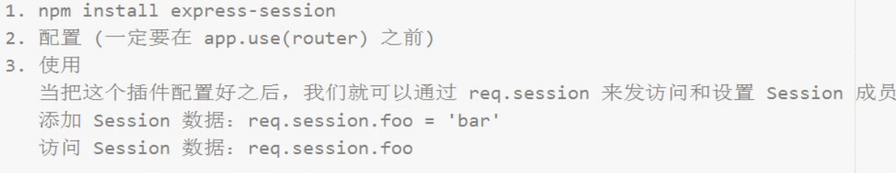

title: Node社区
date: 2019-09-30 17:18:14
---

---
### 1.目录

### 2.模板

### 3.路由设计

| 路径      | 方法 | get参数 | post参数                  | 是否需要登入 | 备注         |
| --------- | ---- | ------- | ------------------------- | ------------ | ------------ |
| /         | GET  |         |                           |              | 渲染首页     |
| /register | GET  |         |                           |              | 渲染注册界面 |
| /register | POST |         | email、nickname、password |              | 处理注册请求 |
| /login    | GET  |         |                           |              | 渲染登录页面 |
| /login    | POST |         | email、password           |              | 处理登入请求 |
| /logout   | GET  |         |                           |              | 处理退出请求 |

处理注册请求

```javascript
router.post('/register',function(req, res){
  // 1. 获取表单注册数据
  // 2. 操作数据库
  // 3. 发送响应
  console.log(req.body)
  var body = req.body
  User.findOne({
    $or: [
      {email: 'body.email'},
      {nickname: 'body.nickname'}
    ]
  }, function (err, data) {
    if (err) {
      return res.status(500).send('Server error.')
    }
    if(data){
      return res.status(200).send('e or name aleary exists')
    }
    res.status(200).send('regist ok')
  })
})
```

由于客户端定义了

```javascript
dataType: 'json'
```

无法识别字符串只能识别json格式

```javascript
/**
 * 处理注册请求
 */
router.post('/register',function(req, res){
  // 1. 获取表单注册数据
  // 2. 操作数据库
  // 3. 发送响应
  var body = req.body
  User.findOne({
    $or: [
      {email: body.email},
      {nickname: body.nickname}
    ]
  }, function (err, data) {
    if (err) {
      return res.status(500).json({
        err_code: 500,
        message:'Server error.'
      })
    }
    if(data){
      return res.status(200).send({
        err_code: 1,
        message:'email or nickname already exists'
      })
    }
    //对密码加密
    body.password = md5(md5(body.password))

    new User(body).save(function(err, user){
      if (err) {
        return res.status(500).json({
          err_code: 500,
          message:'Server error.'
        })
      }
      res.status(200).json({
        err_code: 0,
        message:'ok'
      })
    })
  })
})
```

服务端重定向只对同步请求有用

```
res.redirect('/')
```

异步只能客户端处理

```
window.location.href = '/'
```

安装session插件

```
npm install express-session
```

```javascript
app.use(session({  
    secret: 'keyboard cat',
    resave: false,
    saveUninitialized: true
})) 
```



